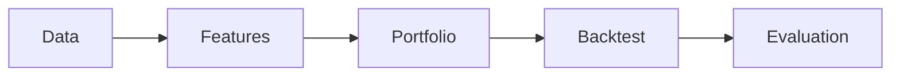

# Architecture

## 1. Purpose & Goals
QuantLab is a cross-sectional equity backtesting framework with emphasis on **correctness by
construction**. Data flows one way through independent layers, each passing a single
canonical structure — a `(date, ticker)` panel. Every pluggable role is a small interface,
so new strategies, cost models, or storage backends slot in without touching the engine.
A run is fully specified by a config + seed and is reproducible.

## 2. Design Principles
1. One data contract — every layer consumes and returns MultiIndex[date, ticker].
2. Point-in-time by construction — features receive a bounded PITView; future access is impossible, not merely discouraged.
3. Labels are the only forward-looking component, and are never fed back as features.
4. Predict -> size -> charge are separate stages (signal, portfolio, cost).
5. Open/closed via interfaces + registries (UNIVERSES, LOADERS).
6. Vectorized cross-sectional engine (panel rebalance), not event-driven — the right tool for a daily/monthly panel.
7. Reproducible — config + seed + git SHA → deterministic output directory.
8. Validation is first-class — the leakage/permutation test lives in the design, not bolted on.

## 3. System Structure & Data Flow

fetch → cache (raw) → build_price_panel → cache (processed) → PriceStore → backtest → evaluation
### Data Contract
panel: DataFrame, index = MultiIndex[date, ticker], sorted
  close_adj    : float   # split + dividend adjusted (returns)
  close_raw    : float   # split-adjusted (dollar sizing later)
  volume       : int
  daily_return : float   # per-ticker close_adj.pct_change()
Invariant: row (t, i) uses only information available at end of day t.
### Look-ahead Firewall
Prevented structurally, in two pieces:
- PriceStore centralises the point-in-time boundary in one method — date_position(date), using
  searchsorted(side="right") to return the last trading day <= date (a Saturday resolves to Friday),
  guarded by an assertion.
- PITView is a per-date bounded view handed to features. Features never receive the full store and there is deliberately no
  forward-return method. Future access is impossible by construction. The forward return that pays the book (calculate_realized_return) is called only by the engine.

## 4. Module Map
```
src/quantlab/
├── config.py # loads NASDAQ_DATA_LINK_API_KEY from .env
├── data/
│ ├── universe.py # dow_30() -> (tickers, name)
│ ├── fetch.py # fetch_data_yf / fetch_data_sharadar (network, once),
│ │ # build_price_panel (raw -> canonical panel),
│ │ # fetch_clean_data / fetch_clean_data_sql (orchestrate + cache)
│ ├── cache.py # parquet (raw + processed) and SQLite (processed) backends
│ └── prices.py # PriceStore (owns the panel) + PITView (point-in-time view)
├── features/
│ ├── base.py # Feature ABC: compute(view, universe); min_history
│ └── momentum.py # Momentum(lookback, lookback_end)
├── labels/
│ └── forward_return.py # ForwardReturn (evaluation / future ML; not on the P1 live path)
├── portfolio/
│ ├── base.py # PortfolioConstructor ABC: weights(scores, prev_weights)
│ └── rank_dollar_neutral.py # RankDollarNeutral(k)
├── backtest/
│ ├── cost.py # CostModel ABC + FixedBPSCost(bps)
│ └── engine.py # BacktestEngine, BacktestResult, month_end_rebalance_dates
├── evaluation/
│ ├── metrics.py # Metrics (Sharpe, Sortino, Calmar, max drawdown, ...)
│ ├── validation.py # permutation_pnl (leakage / significance test)
│ └── tearsheet.py # tearsheet(records, ...) -> PNG
└── pipeline/
├── load_config.py # RunConfig + load_config(path)
└── runner.py # run_from_config; UNIVERSES + LOADERS registries
```
## 5. Core Interfaces
```python
class Feature(ABC):
    min_history: int
    def compute(self, view: PITView, universe: list[str]) -> pd.Series   # data <= asof only

class PortfolioConstructor(ABC):
    def weights(self, scores: pd.Series, prev_weights: pd.Series | None) -> pd.Series

class CostModel(ABC):
    def cost(self, trades: pd.Series) -> float

class BacktestEngine:
    def run(self, rebalance_dates: list, universe: list[str]) -> BacktestResult
```

## 6. Key Design Decisions (decision -> rationale)
1. Cross-sectional equity long-short (momentum) first to test engineering rigor. ML strategies first would add complexity of verifying the correctness/reproducibility of ML pipeline before the backtest is trustworthy
2. The backtest platform is the main product; the alpha is the vehicle.
3. Dow 30, static, to start — sufficient to validate the framework.
4. Vectorized engine, not event-driven — event-driven simulators are for intraday/execution.
5. The look-ahead firewall is structural (PITView), not by convention.
6. Reproducibility by code, not by committing data — data/ is git-ignored and regenerated.

## 7. Extension Model (how new strategies plug in)
New signal: subclass Feature, add one config line.
New cost model: subclass CostModel.
New universe: one entry in UNIVERSES.
New storage backend: one entry in LOADERS.

## 8. Testing & Validation Strategy
The tests encode the correctness claims:
- test_history_boundary_on_a_non_trading_day — the PIT firewall (a Saturday query returns Friday, never Monday).
- returns-correctness on hand-built synthetic panels (known pct_change).
- test_max_drawdown_on_hand_computed_equity + the ">= -1.0" invariant — metric correctness.
- reproducibility: same config + seed → identical output.
permutation_pnl shuffles realized returns across tickers within each period, destroying the
signal -> return link, and builds a null distribution of mean per-period returns. For dollar-neutral book, the null centres at zero by construction; the real strategy's p-value
measures significance, and a spurious edge would surface as an implausibly small p-value — an indirect leakage indicator.