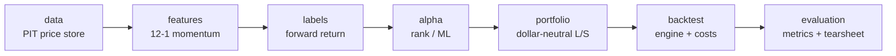

# quantlab — Backtesting Platform

[](https://github.com/Tenthflare/quantlab/actions/workflows/ci.yml)


## Motivation
A cross-sectional equity backtesting platform to evaluate portfolio optimisation and trading strategies.
This project aims to explore the engineering rigor required of a systematic desk: no look-ahead bias, cost accounting,
tested code, modular architecture, defensible results. 
The strategy (12-1 momentum on the Dow 30) is just a demo used to exercise the pipeline.
A more complete/comprehensive dataset would allow for testing of real strategies.

## Key Features
### Lookahead firewall by construction
Feature/strategy uses point-in-time view that can only return data dated ≤ the decision date, not overlapping with data used to calculate forward return.
No lookahead bias is enforced by a runtime assertion and a unit test that a query on a non-trading day returns the prior trading day's data, never the next.
### Statistical test for leakage
For each rebalance period, it takes the strategy's weights (already decided from past-only info) and the realized forward returns, 
then randomly permutes the returns across tickers within that period, breaking any relationship between a name's weight and the return it earns.
It recomputes mean per-period P&L, repeats the randomisation many times to build a null distribution. The real P&L is then compared to it -> a permutation p-value.
For a dollar-neutral book (weights sum to zero), the null's expectation is exactly zero. The test yields:
1. Significance: is the real strategy returns distinguishable from randomly-paired returns (p<0.05)?
2. Indirect leak indicator: a look-ahead bias would inflate the real P&L, resulting in a spuriously small p-value
### Cost-aware backtesting
Transaction cost is included in the backtest, modelled as a fixed basis points per unit traded
### Reproducible backtesting
One run = one config + seed; every output is stamped with the resolved  config and the git commit that produced it.
### Modular framework 
Newer signals, cost models, or ML alphas plug in as one class + one config line — the engine itself never changes.
### Pluggable storage backend
Cleaned panels persist to Parquet or a **SQLite** database (selected by one config line,
`storage: sql | parquet`). The SQL layer uses an explicit schema (PK `(ticker, date)` + date
index) via SQLAlchemy, so the connection string swaps to **Postgres** with no code change.

## Data flow


Outputs land in `output/<run_name>/`: a tearsheet PNG, per-period `records.csv`, and a
`metrics.json` stamped with config + git SHA. Data is fetched once from yfinance and
cached to `data/` (git-ignored); later runs are offline.

## Results (Dow 30, 2011–2026, monthly, dollar-neutral gross 2×, 10 bps)

| Metric | Value |
|---|---|
| Sharpe | −0.08 |
| Annualised return | −2.8% |
| Max drawdown | −58.7% |
| Hit rate | 50.8% |
| **Permutation p-value** | **0.96** |

12-1 momentum shows **no statistically significant edge** on the Dow 30 (p = 0.96) — the
correct, expected result for 30 co-moving mega-caps. The framework's job is to report that
honestly rather than manufacture an inflated Sharpe. The permutation test confirms no leakage;
a spurious edge would show up as an implausibly small p-value.

## Quickstart (demo)
```bash
git clone https://github.com/Tenthflare/quantlab && cd quantlab
python -m venv .venv && source .venv/bin/activate (for Linux)
python -m venv .venv && .venv/Scripts/activate (for Windows)
pip install -e ".[dev]"
python scripts/run_backtest.py configs/momentum_dow30.yaml
```
## Testing

```bash
pytest -q
```

## Roadmap

- **Phase 1 (done):** the rigorous harness, proven on 12-1 momentum.
- **Phase 2:** point-in-time fundamentals (value/quality), blended cross-sectionally.
- **Phase 3:** ML-based alpha behind the same interface, expanded universe

## Stack

Python 3.12+ · pandas / numpy · matplotlib · hatchling · ruff · mypy · pytest · GitHub Actions.

## Project Structure (to be filled)
Brief tree → see [ARCHITECTURE.md]

## License
MIT. 
